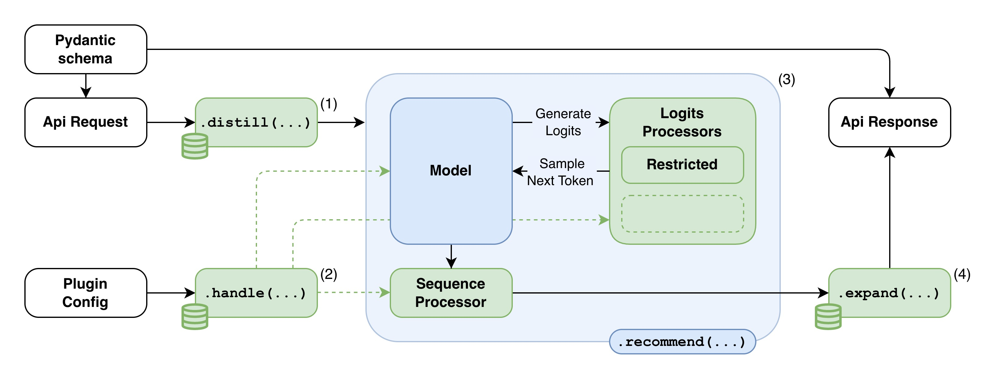

<h1 align="center">🐸 Hoploy</h1>
<p align="center">
  <b>Serving layer for <a href="https://github.com/tail-unica/hopwise">Hopwise</a> recommendation models.</b>
</p>

---

Hoploy is an inference and explanation layer for pre-trained path-reasoning models. It wraps Hopwise models into a deployable REST API service, separating a reusable inference workflow from plugin-defined application logic. The framework handles configuration loading, API construction, component validation, model execution, and request orchestration; plugins provide the domain-specific elements — request and response schemas, preference mapping, decoding controls, and explanation rendering.


## Architecture

The design of Hoploy addresses two practical challenges. On the one hand, a plugin must translate user-facing inputs (selected items, constraints, contextual preferences) into the semantic space of the knowledge graph. On the other hand, it must interact with the representation expected by the path-reasoning model, where paths are generated as token sequences and later converted back into KG triples. Hoploy makes this interaction explicit through a small set of extension components while preserving a fixed execution flow for model inference.

At startup, Hoploy loads the plugin configuration, discovers plugin-defined schemas and components, validates their interfaces, and initializes the inference pipeline. At request time, the pipeline maps the incoming payload to model-compatible inputs, applies request-specific decoding controls, executes path generation, and converts the generated KG paths into the application response.

### Configuration and API Binding

A Hoploy application is defined by two configuration levels. The **framework configuration** (`hoploy/configs/default.yaml`) specifies generic inference behaviour. The **plugin configuration** (`your-plugin/config.yaml`) declares the components and endpoints required by a target application. The merged configuration is the single source of information for both pipeline initialization and API construction.

The API layer is generated from the plugin specification rather than hard-coded in the framework. A plugin declares the request and response schemas associated with each endpoint, together with the pipeline operation or component method that should handle the request. During initialization, Hoploy builds the API application and binds each endpoint to the initialized pipeline. The framework exposes only infrastructure-level endpoints (e.g. health checks); all application endpoints are defined by plugins.

### Extension Components

Plugins extend Hoploy through three component roles:

| Component | Required | Role |
|---|---|---|
| **Wrapper** | Yes | Maps requests to model inputs, configures inference, renders responses |
| **Logits processors** | No | Constrain or guide token-level decoding during path generation |
| **Sequence processor** | No | Post-process complete generated paths before response rendering |

A **catalog service** supports all components by providing a standard interface for resolving application-level identifiers (names, external IDs) into the tokens used by the Hopwise model, and for accessing KG entity metadata.

#### Wrapper

The wrapper is the central component. It is responsible for three operations:

1. **Input distillation** — translates the incoming request (e.g. selected restaurants, dishes, items) into KG entities and token sequences expected by the model.
2. **Inference configuration** — derives request-specific parameters such as the number of recommendations and diversity level.
3. **Output expansion** — converts the generated paths back into KG triples, enriches them with catalog metadata, and renders the final response including recommendations and human-readable explanations.

Path generation itself is handled by the framework through the underlying Hopwise inference procedure; the wrapper controls only how inputs and outputs are interpreted.

#### Logits Processors

Logits processors customize decoding while paths are being generated. At each generation step they adjust the scores of valid candidate tokens before the next token is selected, following the constrained decoding paradigm used in path-reasoning models. Multiple processors can be composed in declaration order. Processors operate on KG-aware candidate representations exposed by the framework, so plugin authors express decoding behaviour in terms of entities and relations without manipulating tokenizer internals directly.

The framework provides default processors for common behaviours: graph-valid traversal constraints, masking of previously recommended items, entity restrictions, and relation-pattern forcing. Plugins can reuse these defaults or specialize them.

#### Sequence Processor

The sequence processor operates after candidate paths have been produced and before they are returned to the wrapper for expansion. Unlike logits processors, it receives complete generated paths and can therefore apply operations such as duplicate removal, invalid sequence filtering, score-based sorting, or domain-specific re-ranking. This component is optional.

### Request Lifecycle



For each incoming recommendation request, Hoploy executes a fixed four-step sequence:

1. **Input distillation** — the wrapper maps the request payload to model-compatible inputs. Selected items are resolved through the catalog and converted into the representation expected by the Hopwise model.
2. **Request-specific configuration** — the wrapper and optional processors derive inference parameters from the request (number of recommendations, entity restrictions, etc.).
3. **Path generation** — the framework executes the recommendation procedure, running the underlying Hopwise model to produce candidate reasoning paths. Plugin-defined logits and sequence processors influence decoding through their configured hooks.
4. **Output expansion** — the wrapper converts the generated paths back into KG triples, enriches them with catalog metadata, and renders the application response including recommendations and human-readable explanations.

Plugins can customize how requests are interpreted, how decoding is constrained, how generated paths are post-processed, and how explanations are rendered. They do not re-implement the generic inference workflow, the model prediction procedure, or the token selection loop.


## Tutorial

This tutorial walks through building and deploying a Hoploy plugin from scratch. The following assumes a Docker-based deployment. Before proceeding, ensure Docker is installed on your machine.

### Step 0: Clone and build

```bash
git clone https://github.com/tail-unica/hoploy
cd hoploy
docker compose build
```

The build step resolves all dependencies from the lockfile, ensuring a reproducible environment across machines.

### Step 1: Create the plugin directory

A Hoploy plugin is a Python package. Create a directory with the following structure:

```
your-plugin/
├── __init__.py
├── config.yaml
├── your_schema.py
└── your_processors.py
```

No framework internals need to be modified — all domain-specific logic lives entirely inside this directory.

### Step 2: Define your schemas

Schemas define the shape of your API: what each endpoint accepts and what it returns. Hoploy uses them to automatically validate requests and generate the API surface at startup. Define them as Pydantic models decorated with `@Request` and `@Response`.

```python
# your-plugin/your_schema.py
from pydantic import BaseModel
from hoploy import Request, Response

@Request("/recommend")
class MyRequest(BaseModel):
    user_id: int
    liked_items: list[str]
    disliked_items: list[str]

@Response("/recommend")
class MyResponse(BaseModel):
    recommendations: list[str]
    explanation: str
```

### Step 3: Implement the Wrapper

The wrapper is the only mandatory component. Subclass `DefaultHopwiseWrapper` and implement `distill` (input mapping) and `expand` (output rendering). Use `handle` to derive request-specific inference parameters.

```python
# your-plugin/your_processors.py
from hopwise.utils import PathLanguageModelingTokenType
from hoploy.registry import Wrapper
from hoploy.components import DefaultHopwiseWrapper

@Wrapper("my-wrapper")
class MyWrapper(DefaultHopwiseWrapper):
    def distill(self, request):
        """Translate request preferences into model-ready token sequences."""
        separator = self.dataset.path_token_separator
        bos = self.dataset.tokenizer.bos_token
        raw_inputs = []
        for item in request.liked_items:
            token = self.encode(item, PathLanguageModelingTokenType.ITEM.token)
            raw_inputs.append(separator.join([bos, token]))
        return raw_inputs

    def handle(self, request):
        """Derive request-specific inference parameters."""
        super().handle(request)
        return self

    def expand(self, values, request):
        """Convert generated paths into the application response."""
        scores, recommendations, explanations = values
        return {
            "recommendations": [self.decode(rec) for rec in recommendations],
            "explanation": [
                "".join([self.decode(t, real_token=True) for t in exp[1:]])
                for exp in explanations
            ],
        }
```

### Step 4: Implement Logits Processors (optional)

Logits processors guide or constrain token-level decoding during path generation. Multiple processors can be declared and are applied in declaration order.

```python
from hopwise.utils import PathLanguageModelingTokenType
from hoploy.registry import LogitsProcessor
from hoploy.components import RestrictedHopwiseLogitsProcessor

@LogitsProcessor("my-logits-processor")
class MyLogitsProcessor(RestrictedHopwiseLogitsProcessor):
    def handle(self, request):
        super().handle(request)
        if request.disliked_items:
            disliked_tokens = [
                self.encode(item, PathLanguageModelingTokenType.ITEM.token)
                for item in request.disliked_items
            ]
            self.set_restrictions(hard_restrictions=disliked_tokens)
        return self
```

### Step 5: Implement a Sequence Processor (optional)

The sequence processor receives complete generated paths and can apply post-generation operations such as filtering, duplicate removal, or re-ranking.

```python
from hoploy.registry import SequenceProcessor
from hoploy.components import DefaultHopwiseSequenceScorePostProcessor

@SequenceProcessor("my-sequence-processor")
class MySequenceProcessor(DefaultHopwiseSequenceScorePostProcessor):
    def handle(self, request):
        super().handle(request)
        return self
```

### Step 6: Configure your plugin

The plugin configuration file declares the components registered in the previous steps and binds them to API endpoints. It merges with the framework defaults at startup.

```yaml
# your-plugin/config.yaml
plugin:
  name: my-plugin
  wrapper: [my-wrapper]
  logits_processors: [my-logits-processor]
  sequence_processor: [my-sequence-processor]
  schema:
    module: your_schema
    get:
      info: my-wrapper.info
    post:
      recommend: run

wrapper:
  pearlm:
    name: my-wrapper
    device: "cuda:0"
    recommendation_count: 5
    diversity_factor: 0.5
    load_col_item: ["item_id", "name"]

logits_processors:
  my-logits-processor:
    name: my-logits-processor

sequence_processor:
  my-sequence-processor:
    name: my-sequence-processor
```

#### Component registration

`wrapper: [my-wrapper]`, `logits_processors: [my-logits-processor]`, and `sequence_processor: [my-sequence-processor]` tell the framework which implementations to load. Each value must match exactly the name passed to the corresponding decorator (`@Wrapper("my-wrapper")`, `@LogitsProcessor("my-logits-processor")`, `@SequenceProcessor("my-sequence-processor")`). Multiple logits processors can be listed and will be applied in declaration order.

The sections below (`wrapper.pearlm`, `logits_processors.my-logits-processor`, etc.) carry component-specific parameters. The model-level keys under `wrapper.pearlm` (`device`, `compile_mode`, `recommendation_count`, `diversity_factor`, etc.) depend on the underlying Hopwise model — refer to the [Hopwise documentation](https://github.com/tail-unica/hopwise) for the full list of supported parameters.

#### Schema and API routing

`schema.module` is the name of the Python file containing the schema definitions (without the `.py` extension). Hoploy imports this module at startup and discovers the `@Request` / `@Response` decorated classes automatically.

The `get` and `post` sections bind HTTP routes to handlers. Each key is the path suffix — it must match the path registered in the `@Request` / `@Response` decorators (e.g. `recommend` binds to `@Request("/recommend")`). Hoploy generates FastAPI routers for these endpoints automatically.

The value on the right-hand side selects the handler:

- **`run`** is a special keyword that passes the validated request body directly into the inference pipeline (distillation → path generation → expansion).
- **`component.method`** binds the route to a specific method on a registered component. For example, `info: my-wrapper.info` creates a `GET /info` endpoint backed by the `info()` method of `my-wrapper`. This is useful for auxiliary endpoints such as metadata inspection or item search. The method receives the request payload and may also access the catalog directly:

```python
from hoploy.core.catalog import get_catalog

@Wrapper("my-wrapper")
class MyWrapper(DefaultHopwiseWrapper):
    ...

    def info(self, request):
        catalog = get_catalog()
        item = catalog.get(request.item_id)
        return {"name": item["name"], "description": item["description"]}
```

### Step 7: Deploy

Add your plugin service to `compose.yaml`:

```yaml
services:
  your-plugin:
    <<: *hoploy-base
    ports:
      - "${YOUR_PLUGIN_PORT:-8100}:8100"
    volumes:
      - ./your-plugin:/app/plugin:ro
      - ./your-dataset-dir:/app/dataset:ro
      - ./your-checkpoints-dir:/app/checkpoints:ro
```

Then start the service:

```bash
docker compose up your-plugin
```

Each plugin runs as an independent Docker service built on a shared `hoploy-base` configuration. At startup, the framework materializes the relevant dataset fields into a Parquet file used as a fast-access catalog cache throughout the service lifetime. The health check endpoint is available at `GET /health`.

API docs are automatically generated by FastAPI and can be accessed at `http://localhost:8100/docs` (or the port you configured). The API surface is defined entirely by the plugin schemas and configuration; the framework does not hard-code any application-specific endpoints.

## Using the API

Hoploy exposes its endpoints through [FastAPI](https://fastapi.tiangolo.com/), which provides automatic request validation, serialization, and interactive documentation. Once a plugin service is running, the full API surface is browsable at `http://localhost:<port>/docs` — all routes, request bodies, and response schemas are generated automatically from the plugin's Pydantic models. No manual API description is needed.

The example below uses the **GreenFoodLens** plugin, which recommends food recipes based on user preferences expressed as item names, soft and hard ingredient restrictions, and previously seen recommendations.

### Example: food recommendation

**Request**

```http
POST /recommend
Content-Type: application/json
```

```json
{
  "user_id": "10009",
  "preferences": ["Classic Creamed Corn Au Gratin"],
  "previous_recommendations": ["Double Corn Polenta"],
  "hard_restrictions": [],
  "soft_restrictions": ["Salt", "Sugar"],
  "recommendation_count": 5,
  "diversity_factor": 0.5
}
```

The framework resolves the item names to knowledge-graph entities (using fuzzy matching when needed), constructs the model input sequences, and runs path generation with the configured logits and sequence processors.

**Internal model trace**

The log output below shows what happens inside Hoploy when the request is processed:

```
INFO:  Resolved 'Classic Creamed Corn Au Gratin' to '32731' via fuzzy match.
DEBUG: distill: 1 raw inputs
DEBUG: previous_recommendations: 0 tokens masked
DEBUG: previous_recommendations: 1 tokens masked
DEBUG: recommend: received 1 raw inputs: ['[BOS] I737']
DEBUG: recommend: tokenized input_ids shape=torch.Size([1, 2]), decoded=['[BOS] I737']
DEBUG: recommend: 1 inputs after special-token filter
INFO:  Executing generation with 1 input samples
DEBUG: recommend: generated 20 raw sequences
DEBUG: recommend: token_sequence_length=8, input_len=2, max_new_tokens=6
DEBUG: Wrapper output: (
  scores=[0.167, 0.167, 0.167, 0.167, 0.167],
  item_ids=[317, 304, 358, 820, 289],
  paths=[
    ['[BOS]', 'I737', 'R1',  'E206858', 'R1', 'I317'],
    ['[BOS]', 'I737', 'R5',  'E206081', 'R2', 'I304'],
    ['[BOS]', 'I737', 'R5',  'E206082', 'R5', 'I358'],
    ['[BOS]', 'I737', 'R5',  'E206081', 'R5', 'I820'],
    ['[BOS]', 'I737', 'R5',  'E206081', 'R5', 'I289']
  ]
)
```

The trace illustrates the full pipeline in action:

- **Fuzzy resolution** — the item name `"Classic Creamed Corn Au Gratin"` is matched to KG entity `32731` (token `I737`).
- **Token masking** — `previous_recommendations` causes `"Double Corn Polenta"` to be masked during decoding, preventing it from appearing again.
- **Path generation** — the model generates 20 raw sequences starting from `[BOS] I737`; `max_new_tokens=6` produces paths of the form `[BOS] → item → relation → entity → relation → item`.
- **Wrapper output** — each path is decoded into a triple chain (item → relation → entity → relation → item) and paired with a score and the resolved item name.

**Response**

```json
{
  "user_id": "10009",
  "recommendations": [
    {
      "food_item": "Southwestern Baked Spaghetti",
      "score": 0.167,
      "explanation": "Classic Creamed Corn Au Gratin → hasPart → ingredient.ground_beef → hasPart → Southwestern Baked Spaghetti"
    },
    {
      "food_item": "Jo Mama's World Famous Spaghetti",
      "score": 0.167,
      "explanation": "Classic Creamed Corn Au Gratin → isCompatibleWith_r → tag.course → isCompatibleWith → Jo Mama's World Famous Spaghetti"
    },
    {
      "food_item": "To Die for Crock Pot Roast",
      "score": 0.167,
      "explanation": "Classic Creamed Corn Au Gratin → isCompatibleWith_r → tag.main-ingredient → isCompatibleWith_r → To Die for Crock Pot Roast"
    },
    {
      "food_item": "Japanese Mum's Chicken",
      "score": 0.167,
      "explanation": "Classic Creamed Corn Au Gratin → isCompatibleWith_r → tag.course → isCompatibleWith_r → Japanese Mum's Chicken"
    },
    {
      "food_item": "Creamy Burrito Casserole",
      "score": 0.167,
      "explanation": "Classic Creamed Corn Au Gratin → isCompatibleWith_r → tag.course → isCompatibleWith_r → Creamy Burrito Casserole"
    }
  ]
}
```

Each recommendation includes the item name, a normalized path score, and a human-readable explanation derived from the reasoning path traversed through the knowledge graph. The full response also carries detailed nutritional, sustainability, and ingredient information for each item — omitted here for brevity.

